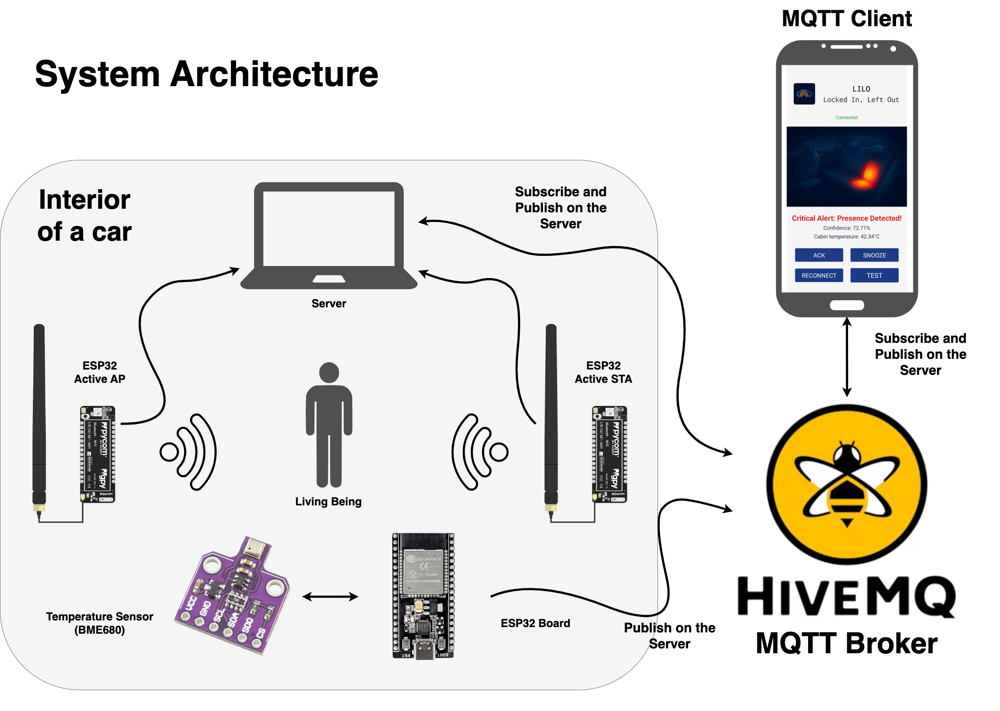

# LILO (Locked-In Left-Out)
### Detecting the Presence of Living Beings Left in Cars Using Wi-Fi Channel Sensing

This repository contains the source code and documentation for an engineering project developed at AGH University of Krakow. The system, named **LILO**, utilizes Wi-Fi Channel State Information (CSI) and TinyML to detect the presence of occupants (children or pets) left in a vehicle to prevent hyperthermia and other heat-related hazards.

## System Architecture

The LILO system is a non-invasive, device-free sensing solution that monitors the vehicle cabin environment without compromising privacy. It consists of three main segments: the data acquisition layer (ESP32), the edge-processing server (TinyML), and the user notification layer (MQTT & Mobile App).

  

  <em>Figure 1: High-level overview of the LILO system architecture.</em>

## Key Features

* **Device-Free Sensing:** Detects presence without requiring the occupant to wear any sensors or transmitters.
* **Privacy-First:** Uses raw Wi-Fi signals (CSI) instead of cameras, ensuring passenger privacy.
* **Edge Computing (TinyML):** Optimized Multi-Layer Perceptron (MLP) models running on resource-constrained devices.
* **Environmental Fusion:** Integrates temperature measurements to assess real-time danger levels.
* **Multi-Level Notifications:** Immediate alerts via MQTT protocol and a dedicated Android application.

## Repository Structure

* `esp32-fw/` – Firmware for ESP32 modules (Access Point, Station, and Passive modes).
* `analysis/` – Python tools for CSI data parsing, feature engineering, and model training.
* `models/` – Trained and quantized ML models (TinyML, MLP, Random Forest).
* `server/` – Real-time inference scripts and MQTT client for system operation.
* `mobile_app/` – Source files for the LILO Android application (MIT App Inventor).

## Technologies Used

* **Hardware:** ESP32 (Espressif Systems), Temperature Sensors.
* **Protocols:** Wi-Fi (802.11n), CSI, MQTT, Serial.
* **Machine Learning:** PyTorch (Model development), TinyML (Optimization), Quantization (INT8).
* **Languages:** C++, Python, G (MIT App Inventor).

## Author and Context

* **Author:** Filip Żurek
* **Supervisor:** prof. dr hab. inż. Katarzyna Kosek-Szott
* **Institution:** AGH University of Krakow
* **Faculty:** Faculty of Computer Science, Electronics and Telecommunications
* **Field of Study:** Electronics and Telecommunications
* **Degree Program:** Bachelor of Science (Engineering Thesis)
* **Project Year:** 2025/2026

## License

This software is distributed under the **MIT License**. Refer to the [LICENSE](LICENSE) file for the full text.

---
*© 2026 Filip Żurek - AGH University of Krakow. All rights reserved.*