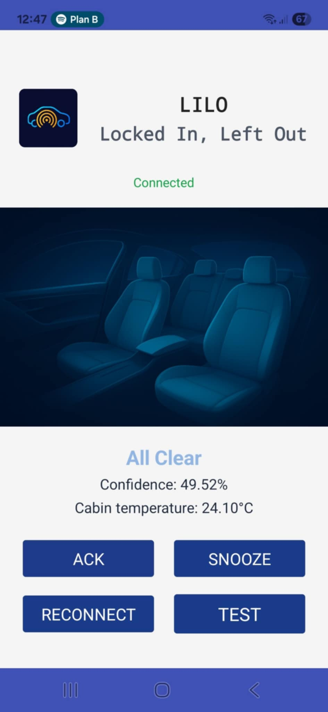
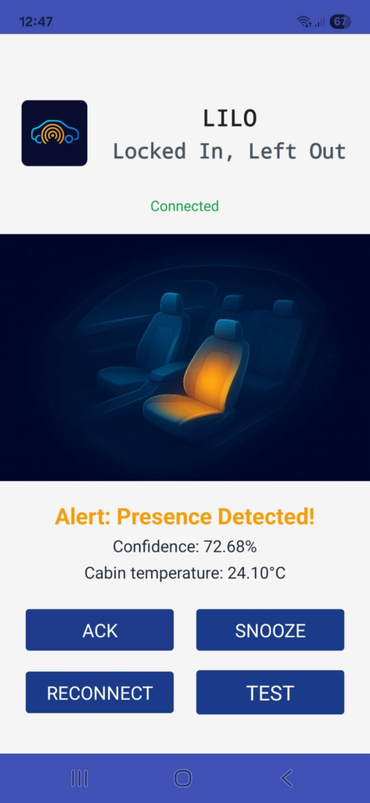
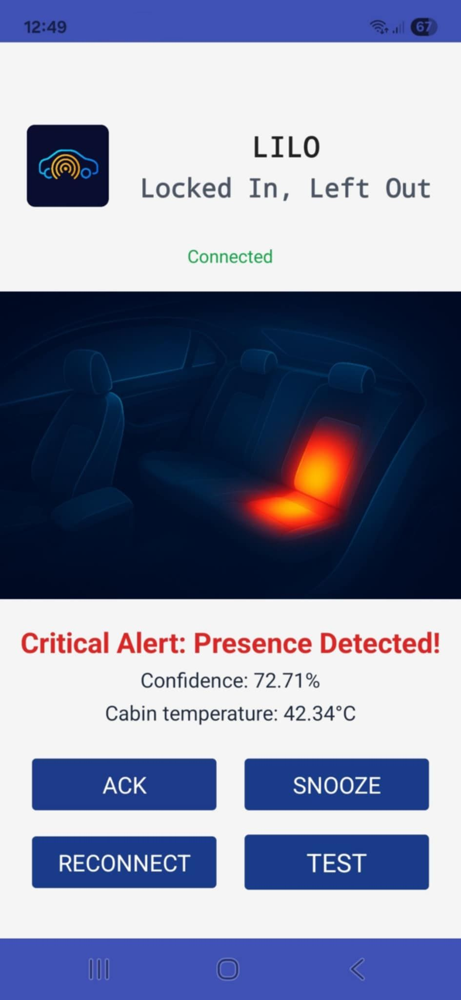

# LILO Mobile Application

This directory contains the source files and release versions of the mobile application for the **LILO** (Locked-In Left-Out) system. The application serves as the primary user interface for real-time monitoring and emergency notifications.

## Overview

The LILO mobile application is a lightweight Android-based tool developed using the **MIT App Inventor** platform. It acts as the final layer of the system architecture, receiving processed data and alerts from the server via the **MQTT** protocol to inform caretakers of potential hazards in the vehicle.

## Application Interface

  
  
  

  <em>Figure 1: Mobile application interface - Main Dashboard, Environmental Data, and Emergency Alerts.</em>

## Key Features

* **Real-time Environmental Monitoring:** Displays live data from the vehicle cabin, including temperature, humidity, and air quality metrics.
* **Occupant Status Dashboard:** Visual indicator showing whether the vehicle is "Empty" or "Occupied" based on TinyML inference.
* **Multi-level Emergency Alerts:** Triggering push notifications and acoustic signals when dangerous temperature thresholds are exceeded while presence is detected.
* **MQTT Connectivity:** Configurable client that subscribes to system topics (e.g., `esp32/bme680_temp`, `lilo/inference_result`).

## Folder Structure

* **`source/`**: Contains the `LILO.aia` file, which is the complete source project for MIT App Inventor.
* **`release/`**: Contains the compiled installation files (e.g., `.apk`) for direct deployment on Android devices.

## Installation and Usage

### Using the Source File (.aia)
1.  Log in to the [MIT App Inventor](http://ai2.appinventor.mit.edu/) web interface.
2.  Go to `Projects` -> `Import project (.aia) from my computer`.
3.  Select the `LILO.aia` file from the `source/` directory.
4.  You can now modify the logic or build the application for your device.

### Installing the Release Version
1.  Transfer the file from the `release/` directory to your Android smartphone.
2.  Enable "Install from unknown sources" in your device settings.
3.  Install the application and launch it.

## Configuration

To establish a connection with the LILO system, ensure the following settings are correctly applied within the app:
* **MQTT Broker Address:** Set to the IP of your central server (e.g., `192.168.1.107`).
* **Port:** Default MQTT port `1883`.
* **Topics:** Ensure the app is subscribed to the topics published by the `server/` and `temperature_sensor/` modules.

---
*The mobile application is an integral part of the LILO Engineering Thesis project at AGH University of Krakow.*